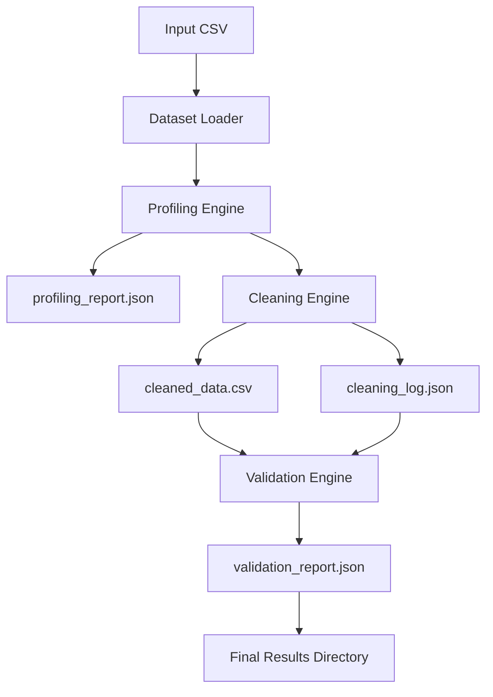

# System Architecture

Status: proposed, not implemented.

## Architectural Goal

Build a modular Python backend pipeline where generic data-quality logic is separated from dataset/domain-specific configuration.

## Proposed Components

| Component | Responsibility |
| --- | --- |
| CLI | Parse input/output/config paths and launch the pipeline. |
| Configuration loader | Load YAML settings and domain rules. |
| Dataset loader | Read input data and produce a standard internal dataset object. |
| Profiling engine | Analyze metadata, types, missingness, distributions, correlations, suspicious columns, and PII signals. |
| Cleaning engine | Apply imputation, duplicate handling, normalization, transformations, and quality scoring. |
| Validation engine | Apply deterministic rules, anomaly detection, semantic checks, drift checks, and severity scoring. |
| Report writers | Persist JSON/CSV/visual artifacts using documented schemas. |
| Evaluation utilities | Compare predictions/actions against known ground truth where available. |
| Logging | Record operational events without leaking sensitive values. |

## Proposed Package Boundaries

```text
src/
  cadetx_quality/
    cli/
    config/
    data/
    profiling/
    cleaning/
    validation/
    scoring/
    evaluation/
    reporting/
    pipeline/
```

This is proposed only. Final package layout remains open until implementation begins.

## Pipeline Flow



## Schemas and Contracts

Planned contracts:

- Input dataset contract: tabular file plus config.
- Profiling report schema: metadata, column profiles, quality warnings, visual references.
- Cleaning log schema: actions, parameters, affected columns/rows, before/after metrics.
- Validation report schema: rule violations, anomalies, semantic issues, severities, health score, evaluation summary.
- Pipeline result contract: output directory containing all expected artifacts.

Schemas should be documented before or alongside implementation.

## Configuration

YAML configuration should own:

- Input parsing options
- Dataset/domain rules
- Column semantic hints
- Validation rules
- Cleaning strategy choices
- ML model parameters
- Output artifact settings

## Error Handling

- Invalid input paths should fail clearly.
- Unsupported column operations should be reported, not silently ignored.
- Recoverable column-level errors should be logged and included in reports.
- Fatal errors should stop the pipeline with actionable messages.

## Logging

Use structured, concise logs for:

- Pipeline start/end
- Loaded config
- Major module boundaries
- Warnings and skipped operations
- Output artifact paths

Logs must avoid dumping raw PII-like values.

## Testing Boundaries

- Unit tests for individual profilers, cleaners, validators, scorers, and schema writers.
- Integration tests for module-level workflows.
- End-to-end tests for the full CLI pipeline.
- Evaluation tests using controlled corruption labels.

## Generic Logic vs Dataset Rules

Generic logic should not hardcode one demo dataset. Dataset-specific rules belong in configuration or fixtures. Overengineering a universal framework is also out of scope.

## ML Boundaries

ML components should expose deterministic interfaces, record parameters and seeds, and be evaluated against baselines. Simpler deterministic methods remain acceptable when they outperform or better explain behavior.

